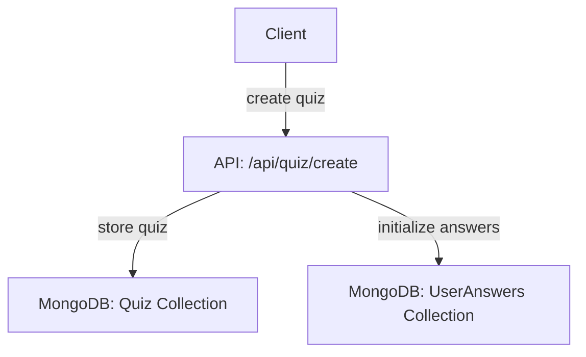
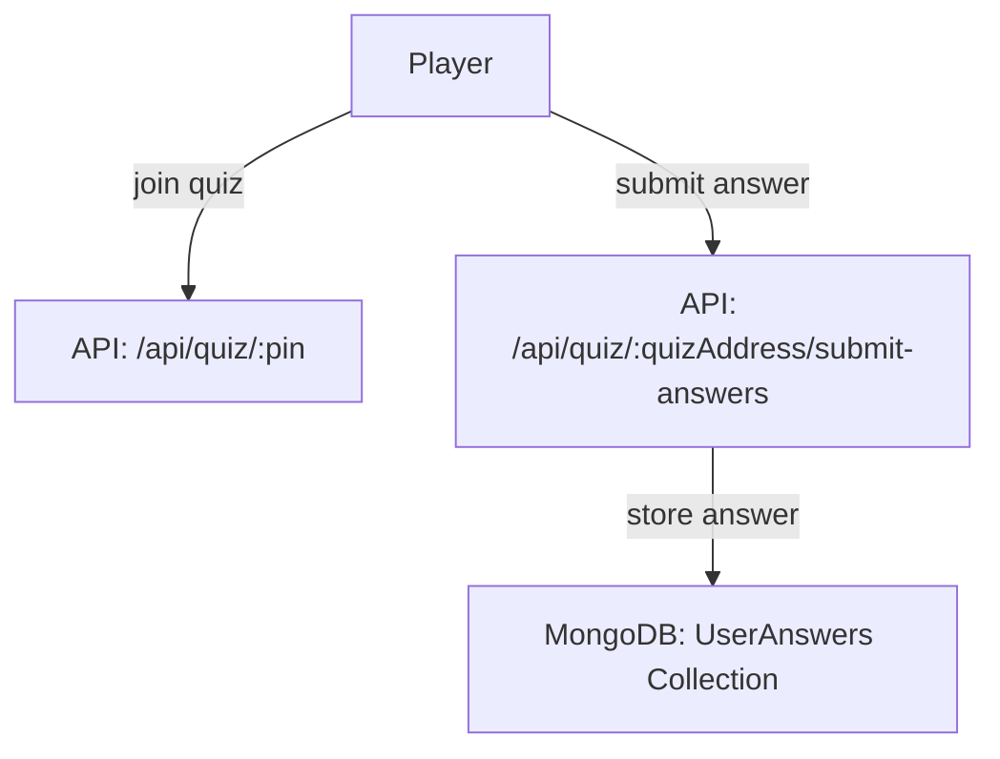
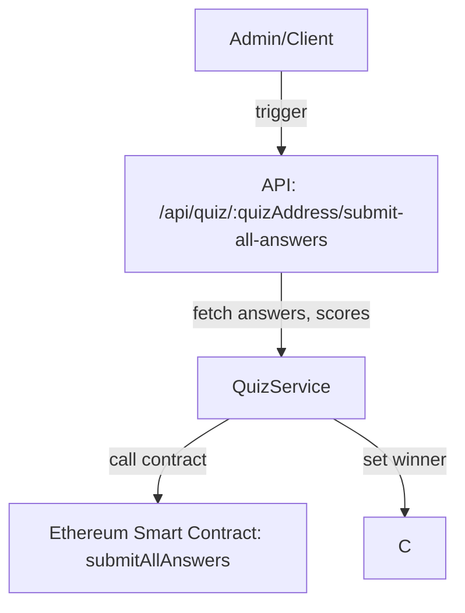
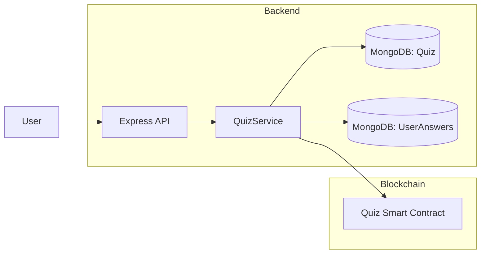

# QuizApp-Backend: Project Overview, Architecture & Workflow

## About the Project

**QuizApp-Backend** is the backend service powering the QuizApp decentralized quiz platform. Built with Node.js and TypeScript, it manages quiz creation, player participation, answer collection, and seamless integration with Ethereum smart contracts. The backend ensures secure storage, reliable quiz flow, and transparent, on-chain anchoring of results.

**Key Objectives:**
- Provide API endpoints to handle quiz lifecycle: creation, participation, answer submission, and contract interaction.
- Persist quiz and answer data securely in MongoDB.
- Serve as a bridge between the frontend app and Ethereum blockchain for trustless quiz results.
- Enable secure winner determination and transparent game logic.

---

## Core Features

- **Quiz Management:** Create quizzes, store questions, and manage players.
- **Answer Submission:** Collect and store answers from players in MongoDB.
- **Smart Contract Integration:** Submit all answers and scores to an on-chain smart contract for transparency and trust.
- **Winner Determination:** Calculate and persist the winner for each quiz.
- **REST API:** Exposes endpoints for quiz creation, participation, answer submission, and contract interaction.

---

## Main Technologies

- **TypeScript** (Node.js)
- **MongoDB** (data storage)
- **Ethers.js** (Ethereum contract interaction)
- **Express.js** (REST API)

---

## Workflow Overview

### 1. Quiz Creation



### 2. Player Joining & Answer Submission



### 3. Submitting All Answers On-chain



---

## Data Model

The main quiz document in MongoDB:

```typescript
{
  pin: string;
  creatorAddress: string;
  quizAddress: string;
  quizName: string;
  answersString: string;
  playerAddresses: string[];
  questions: [
    {
      question: string;
      answers: string[];
      correctAnswer: number;
    }
  ];
  winner: string; // Set after quiz ends
  createdAt: Date;
  updatedAt: Date;
}
```

---

## Smart Contract Interaction

- The backend prepares player addresses, their concatenated answers, and scores.
- Calls the contract function:
    ```solidity
    function submitAllAnswers(
      address[] calldata players,
      string[] calldata answers,
      uint128[] calldata scores
    ) external {}
    ```
- Transaction can be signed by backend or prepared for frontend signing for security.

---

## API Endpoints (Summary)

- `POST /api/quiz/create` — Create new quiz
- `GET /api/quiz/:pin` — Get quiz by PIN
- `POST /api/quiz/:pin/end` — End quiz and set winner
- `POST /api/quiz/:quizAddress/submit-answers` — Submit a player's answer
- `POST /api/quiz/:quizAddress/submit-all-answers` — Submit all answers and scores to blockchain

---

## Data Flow Diagram



---

## Security & Decentralization Note

- For security, transaction data for smart contract calls can be **prepared by the backend** but **signed in the frontend** with the user's wallet. This pattern ensures users control their funds and signatures, with the backend acting as a coordinator for quiz logic and data.

---

*For more technical details, see the [README.md](./README.md) in the repository.*
