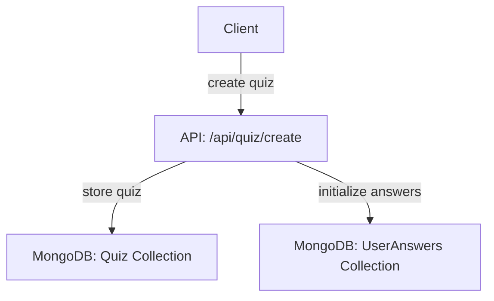

```mermaid
graph TD
    A[Client] -- create quiz --> B[API: /api/quiz/create]
    B -- store quiz --> C[MongoDB: Quiz Collection]
    B -- initialize answers --> D[MongoDB: UserAnswers Collection]
```
